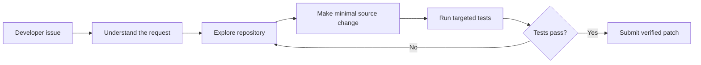

# tAilorCode

## From customer support AI to autonomous code repair

tAilorCode is my autonomous coding agent project for the [Google - The Gemma 4 Developer Agent Competition](https://www.kaggle.com/competitions/gemma-4-developer-agent), hosted by Google DeepMind on Kaggle.

The project transfers ideas from my previous KelceTS customer-support and autonomous-agent work into software engineering. Instead of answering a customer incident, tAilorCode investigates a repository issue, edits the relevant source code, runs targeted tests, and returns a reviewable Git patch.



## Competition requirements

The competition submission is a declarative `submission.zip` archive containing `agent.yaml` at its root. The agent must use the registered Gemma 4 model and work through the competition harness. The public dataset contains repository snapshots, tasks, graphs, embeddings, and offline dependency wheels.

The evaluation process privately re-runs the selected Kaggle Notebook with a hidden dataset, extracts `submission.zip` from `/kaggle/working`, and evaluates the generated agent configuration. The main metric is Resolution Rate: the proportion of repository tasks whose generated patches pass verification.

## Current implementation

The tAilorCode configuration includes:

- `agent.yaml` with the required Gemma 4 model;
- prompts for the root coding agent and a read-only code analyst;
- an `AgentTool` sub-agent for repository navigation;
- repository, file, editing, testing, status, patch, and graph tools;
- sampling and evaluation budget configuration;
- a self-contained notebook path that can recreate the submission without Internet access.

The first public smoke-test tasks selected for future evaluation are:

- `fastapi_14786`: strip unwanted whitespace from authorization credentials;
- `rich_4077`: proxy `isatty()` in `FileProxy`;
- `requests_6592`: add the `too_early` alias for HTTP status code 425.

## Kaggle progress

The Kaggle Notebook was created as `tAilorCode - First Evaluation`.

Completed successfully:

1. Joined the competition.
2. Attached the competition dataset.
3. Created a private dataset named `tAilorCode-submission-package`.
4. Verified the submission structure and model declaration.
5. Created a valid `submission.zip` with `agent.yaml` at the archive root.
6. Saved Notebook versions successfully.

The first competition submission failed during Kaggle's private re-run. Kaggle only exposed the generic code-competition debugging page, so the exact hidden error was not shown.

The likely root cause was the Notebook's dependency on the additional private input dataset. Kaggle may not preserve that extra dataset during the hidden competition re-run, even though it is available during interactive development.

## Important correction for the next submission

The local Notebook has been changed so that it embeds the small tAilorCode submission files directly in a Python cell. It no longer depends on:

- `git clone`;
- Internet access;
- the private `tAilorCode-submission-package` dataset;
- a fixed `/kaggle/input` path.

The embedded cell creates these files directly in the working directory:

```text
agent.yaml
eval_config.yaml
configs/sampling.yaml
prompts/system.md
prompts/analyzer.md
sub_agents/code_analyzer.yaml
```

It uses `/kaggle/working` inside Kaggle and a local fallback directory when tested on macOS. The local validation passed for both the submission structure and ZIP creation.

## Resume here tomorrow

Use the corrected Notebook located locally at:

```text
/Users/LDAAFM/Downloads/tailorcode-first-evaluation.ipynb
```

Before making another submission:

1. Import the corrected Notebook into Kaggle as a new version.
2. Attach only the competition dataset. The private submission dataset should no longer be required.
3. Keep Internet disabled.
4. Run the embedded submission-generation cell.
5. Run the validation cell and confirm:

```text
The tAilorCode submission structure is valid.
The required Gemma 4 model is declared correctly.
```

6. Run the packaging cell and confirm:

```text
The submission archive is ready.
```

7. Save a new Notebook version.
8. Wait for the daily submission limit to reset before submitting again.
9. Submit once using:

```text
Version name: tAilorCode - Baseline 02
Description: Offline-ready tAilorCode Gemma 4 coding-agent baseline.
Output file: submission.zip
```

Do not submit repeatedly if Kaggle reports a failure. Record the exact error class first.

## Local environment note

The Mac workspace contains the public competition data, but it does not have the `swegemma` CLI, Docker, or the local Gemma server. The Google ADK package is available in the Kaggle Notebook, but the full harness evaluation is performed by the competition infrastructure.

Insomnia is not needed for the competition agent because it is not evaluated as an HTTP API. It may be used later for an optional `tAilorCode Workbench` demonstration.

## Authorship

This project is created, directed, and owned by **Araceli Fradejas Munoz**. The project is inspired by my previous KelceTS AI assistant and autonomous-agent work, but the competition implementation is developed specifically for this challenge.

## Author

**Araceli Fradejas Munoz**

- GitHub: [AraceliFradejas](https://github.com/AraceliFradejas)
- Project: [tailorcode-gemma-developer-agent](https://github.com/AraceliFradejas/tailorcode-gemma-developer-agent)
- LinkedIn: [Araceli Fradejas Munoz](https://www.linkedin.com/in/araceli-fradejas-munoz-transformaciondigital/)
- X: [@AraceliFradejas](https://twitter.com/AraceliFradejas)
- Medium: [Araceli Fradejas](https://medium.com/@araceli.fradejas)
- YouTube: [Araceli Fradejas Munoz](https://www.youtube.com/@aracelifradejasmunoz2758)
