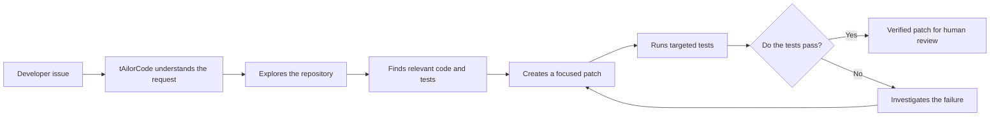
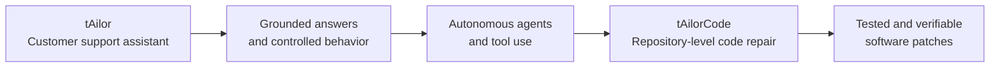
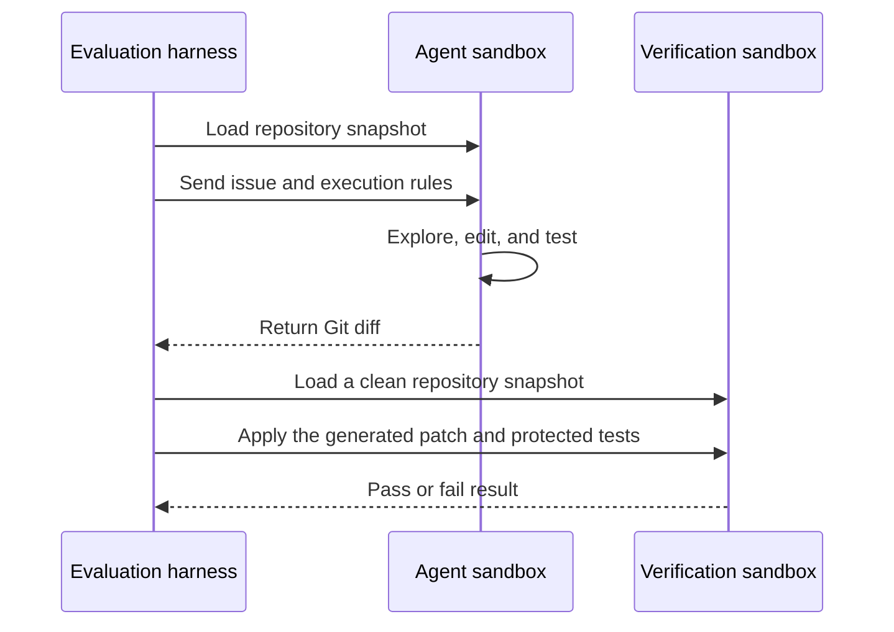

# tAilorCode

## From customer support AI to autonomous code repair

tAilorCode is an autonomous coding agent being developed for and submitted to the [Google - The Gemma 4 Developer Agent Competition](https://www.kaggle.com/competitions/gemma-4-developer-agent).

Its purpose is simple: help developers turn a repository issue into a focused, tested, and reviewable code patch.

The project grows out of my previous work building AI assistants and autonomous workflows for the fictional KelceTS company. In that work, the agent helped customer support teams understand messages, use trusted information, follow business rules, and decide when an issue needed escalation. tAilorCode takes those same principles into software engineering.

Instead of answering a customer incident, it investigates a repository issue. Instead of drafting a support reply, it proposes a code change. Instead of stopping at a plausible answer, it runs targeted tests and returns a patch that can be independently verified.

## The idea



The agent is designed to work carefully rather than blindly:

1. Understand the problem statement and available hints.
2. Navigate the repository and identify the smallest relevant area.
3. Use source files, tests, and code-intelligence tools as evidence.
4. Make a minimal implementation change.
5. Run targeted verification inside the sandbox.
6. Submit the resulting Git diff for independent evaluation.

## Why this project exists

This project represents a progression in my practical work with generative AI:



The central idea is that a useful agent should understand context, rely on available evidence, take controlled actions, and verify the result before presenting it.

## Competition setting

This project is being developed as my submission to the [Google - The Gemma 4 Developer Agent Competition](https://www.kaggle.com/competitions/gemma-4-developer-agent), hosted by Google DeepMind on Kaggle.

The competition evaluates agents on real-world Python bug fixes and feature requests. The public training set includes repository snapshots, task descriptions, tests, code graphs, and embeddings for local development.

tAilorCode is packaged as a declarative Google ADK submission. The submission is built from YAML configuration, prompts, optional skills, optional sub-agents, and optional LoRA adapters. It does not use a custom Python entry point.

The evaluation process uses two isolated stages:



The final result is measured by **Resolution Rate**: the proportion of evaluated tasks whose patches pass the required verification tests.

## Repository structure

```text
tailorcode-gemma-developer-agent/
├── README.md
├── submission/       # Competition agent configuration
├── notebooks/        # Public experiments and visual explanations
├── docs/             # Project story, architecture, and diagrams
└── results/          # Selected local evaluation summaries
```

Competition data and large local evaluation assets are intentionally kept outside the public project source. They are not required to understand the agent configuration and must not be committed as part of this repository.

## Project status

This project is being developed incrementally alongside my master's studies. The first milestone is a valid, understandable baseline submission. Later milestones will focus on targeted repository navigation, reliable editing, test verification, local evaluation, and a small visual demonstration for developers.

## Documentation roadmap

- Project story for a general audience.
- Technical architecture based on the competition harness.
- Mermaid diagrams explaining the agent workflow.
- Local evaluation notes and selected results.
- A companion notebook for experiments and visual explanations.
- A possible `tAilorCode Workbench` demonstration interface.

## Authorship

This project is created, directed, and owned by **Araceli Fradejas Munoz**. The design decisions, project direction, experiments, and final submission remain under my authorship and review.

The project is inspired by my earlier KelceTS AI assistant and autonomous-agent work, but the tAilorCode competition implementation is developed specifically for this challenge and its technical constraints.

## License and competition notice

The competition dataset is provided under its published competition terms and is not included in this repository. Any future public release of competition code, documentation, or results will follow the applicable Kaggle rules and third-party licenses.

## Author

**Araceli Fradejas Munoz**

- GitHub: [AraceliFradejas](https://github.com/AraceliFradejas)
- Project: [tailorcode-gemma-developer-agent](https://github.com/AraceliFradejas/tailorcode-gemma-developer-agent)
- LinkedIn: [Araceli Fradejas Munoz](https://www.linkedin.com/in/araceli-fradejas-munoz-transformaciondigital/)
- X: [@AraceliFradejas](https://twitter.com/AraceliFradejas)
- Medium: [Araceli Fradejas](https://medium.com/@araceli.fradejas)
- YouTube: [Araceli Fradejas Munoz](https://www.youtube.com/@aracelifradejasmunoz2758)