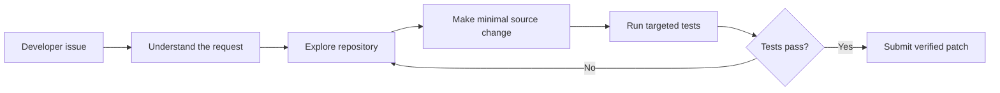

# tAilorCode

## From customer support AI to autonomous code repair

tAilorCode is my autonomous coding agent project for the [Google - The Gemma 4 Developer Agent Competition](https://www.kaggle.com/competitions/gemma-4-developer-agent), hosted by Google DeepMind on Kaggle.

The project transfers ideas from my previous KelceTS customer-support and autonomous-agent work into software engineering. Instead of answering a customer incident, tAilorCode investigates a repository issue, edits the relevant source code, runs targeted tests, and returns a reviewable Git patch.

## Competition requirements

The competition submission is a declarative `submission.zip` archive containing `agent.yaml` at its root. The agent must use the registered Gemma 4 model and work through the competition harness. The public dataset contains repository snapshots, tasks, graphs, embeddings, and offline dependency wheels.

The evaluation process privately re-runs the selected Kaggle Notebook with a hidden dataset, extracts `submission.zip` from `/kaggle/working`, and evaluates the generated agent configuration. The main metric is Resolution Rate: the proportion of repository tasks whose generated patches pass verification.

## Current implementation

The tAilorCode configuration includes:

- `agent.yaml` with the required Gemma 4 model;
- inline prompts for the root coding agent and a read-only code analyst;
- an `AgentTool` sub-agent for repository navigation;
- repository, file, editing, testing, status, patch, and graph tools;
- sampling and evaluation budget configuration;
- a self-contained notebook path that can recreate the submission without Internet access.

The first public smoke-test tasks selected for future evaluation are:

- `fastapi_14786`: strip unwanted whitespace from authorization credentials;
- `rich_4077`: proxy `isatty()` in `FileProxy`;
- `requests_6592`: add the `too_early` alias for HTTP status code 425.

## Current development workflow

The current source of truth is `agents/baseline/`. Rebuild the self-contained Kaggle notebook with `scripts/build_submission.py`; `--check` detects a stale notebook before submission. GitHub Actions checks YAML, archive contents, and reproducibility. These checks do not run Gemma or establish a competition score.

See [Development workflow](docs/development-workflow.md) for local commands and the three-task smoke suite, or [open the development checks in Colab](https://colab.research.google.com/github/AraceliFradejas/tailorcode-gemma-developer-agent/blob/main/notebooks/tailorcode-colab-checks.ipynb). CPU is sufficient for the development checks.

For Kaggle packaging, use `deliverables/tailorcode-submit-ready.ipynb`. The older notebook under `notebooks/tailorcode-first-evaluation.ipynb` is historical development work.

## Kaggle status — September 27, 2026

The self-contained notebook created `submission.zip` in Kaggle. Version 11 and three earlier submissions were listed as **Kaggle Error**, with a message describing a system error and advising contact with support. The submission details list the ZIP, but no specific hidden diagnostic or score is available.

A support request has been sent. The root cause is unconfirmed; neither successful packaging nor the generic error establishes whether the agent compiles or performs well. See [the support checkpoint](docs/progress-2026-09-27.md) for the version link and recorded observations.

The local smoke-suite preparation found all three public tasks and their snapshots. Actual agent evaluation has not run: the Mac lacks the official harness CLI, Docker, and NVIDIA inference runtime. The baseline has now passed an [official compiler construction check](docs/compiler-check-2026-09-27.md) with inert tool bindings and no inference. A measured public smoke run in a suitable environment remains outstanding.

## Local environment note

The Mac workspace contains the public competition data, but it does not have the `swegemma` CLI, Docker, or the local Gemma server. The Google ADK package is available in the Kaggle Notebook, but the full harness evaluation is performed by the competition infrastructure.

Insomnia is not needed for the competition agent because it is not evaluated as an HTTP API. It may be used later for an optional `tAilorCode Workbench` demonstration.

## Authorship

This project is created, directed, and owned by **Araceli Fradejas Munoz**. The project is inspired by my previous KelceTS AI assistant and autonomous-agent work, but the competition implementation is developed specifically for this challenge.

## Author

**Araceli Fradejas Munoz**

- GitHub: [AraceliFradejas](https://github.com/AraceliFradejas)
- Project: [tailorcode-gemma-developer-agent](https://github.com/AraceliFradejas/tailorcode-gemma-developer-agent)
- LinkedIn: [Araceli Fradejas Munoz](https://www.linkedin.com/in/araceli-fradejas-munoz-transformaciondigital/)
- X: [@AraceliFradejas](https://twitter.com/AraceliFradejas)
- Medium: [Araceli Fradejas](https://medium.com/@araceli.fradejas)
- YouTube: [Araceli Fradejas Munoz](https://www.youtube.com/@aracelifradejasmunoz2758)
