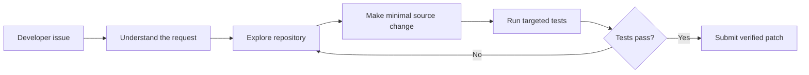

# tAilorCode

## From customer support AI to autonomous code repair

tAilorCode is my autonomous coding agent project for the [Google - The Gemma 4 Developer Agent Competition](https://www.kaggle.com/competitions/gemma-4-developer-agent), hosted by Google DeepMind on Kaggle.

The project transfers ideas from my previous KelceTS customer-support and autonomous-agent work into software engineering. Instead of answering a customer incident, tAilorCode investigates a repository issue, edits the relevant source code, runs targeted tests, and returns a reviewable Git patch.

## Competition requirements

The competition submission is a declarative `submission.zip` archive containing `agent.yaml` at its root. The agent must use the registered Gemma 4 model and work through the competition harness. The public dataset contains repository snapshots, tasks, graphs, embeddings, and offline dependency wheels.

The evaluation process privately re-runs the selected Kaggle Notebook with a hidden dataset, extracts `submission.zip` from `/kaggle/working`, and evaluates the generated agent configuration. The main metric is Resolution Rate: the proportion of repository tasks whose generated patches pass verification.

## Current implementation

The tAilorCode configuration includes:

- `agent.yaml` with the required Gemma 4 model;
- inline prompts for the root coding agent and a read-only code analyst;
- an `AgentTool` sub-agent for repository navigation;
- repository, file, editing, testing, status, patch, and graph tools;
- sampling and evaluation budget configuration;
- a self-contained notebook path that can recreate the submission without Internet access.

The first public smoke-test tasks selected for future evaluation are:

- `fastapi_14786`: strip unwanted whitespace from authorization credentials;
- `rich_4077`: proxy `isatty()` in `FileProxy`;
- `requests_6592`: add the `too_early` alias for HTTP status code 425.

## Current development workflow

The current source of truth is `agents/baseline/`. Rebuild the self-contained Kaggle notebook with `scripts/build_submission.py`; `--check` detects a stale notebook before submission. GitHub Actions checks YAML, archive contents, and reproducibility. These checks do not run Gemma or establish a competition score.

See [Development workflow](docs/development-workflow.md) for local commands and the three-task smoke suite, or [open the development checks in Colab](https://colab.research.google.com/github/AraceliFradejas/tailorcode-gemma-developer-agent/blob/main/notebooks/tailorcode-colab-checks.ipynb). CPU is sufficient for the development checks.

CPU sufficiency does not mean zero cost: the inspected Colab account consumed compute units even on CPU. Runtime use requires the owner's prior approval of costs or paid-credit consumption.

For Kaggle packaging, use `deliverables/tailorcode-submit-ready.ipynb`. The older notebook under `notebooks/tailorcode-first-evaluation.ipynb` is historical development work.

## Kaggle status — October 4, 2026

The self-contained notebook created `submission.zip` in Kaggle. Version 11 and three earlier submissions were listed as **Kaggle Error**, with a message describing a system error and advising contact with support. The submission details list the ZIP, but no specific hidden diagnostic or score is available.

Kaggle Support replied on September 28, directing the question to the competition forums without providing a diagnostic or confirming an infrastructure incident. On October 4, Araceli decided to post the prepared question herself in the [competition discussion forum](https://www.kaggle.com/competitions/gemma-4-developer-agent/discussion). Publication and a topic URL have not yet been confirmed.

Development will continue in Colab, with progress documented in this repository. Another Kaggle submission is deferred until the submission problem is resolved or there is actionable guidance for a new attempt. The root cause remains unconfirmed; neither successful packaging nor the generic error establishes whether the agent runs or performs well. See [the support checkpoint](docs/progress-2026-09-27.md) for the version link and recorded observations.

The local smoke-suite preparation found all three public tasks and their snapshots. The baseline has passed an [official compiler construction check](docs/compiler-check-2026-09-27.md) with inert tool bindings and no inference. A measured public smoke run in a suitable environment remains outstanding. The organizer's starter supports a subprocess sandbox, so Docker is not required for the prepared notebook path.

## Latest checkpoint and project memory

Read [MEMORY.md — session record and explanation in Spanish](MEMORY.md) to resume the work or explain its development. It records completed work, decisions, limitations, the Colab stop message, and the next steps.

| Stage | Verified status |
| --- | --- |
| Submission packaging | Reproducible notebook and ZIP checked locally; an earlier ZIP was created on Kaggle |
| Configuration compilation | Real official compiler/ADK objects constructed; tools were inert and no model ran |
| Development checks in Colab | CPU checks passed; notebook and outputs saved privately in Drive |
| One-task public evaluation | Notebook and runner prepared and saved; **not executed with Gemma** |
| Local tests | All 10 automated tests passed again on October 4; earlier installer hash and stop checks also passed |
| GPU setup | Isolated stack installed and selected imports passed on Colab CPU October 4; **GPU serving not validated** |
| Kaggle scoring | Four observed system-error submissions; support referred the case to the forum; no score recorded |

The [one-task notebook](https://colab.research.google.com/github/AraceliFradejas/tailorcode-gemma-developer-agent/blob/main/notebooks/tailorcode-public-smoke.ipynb) now has guided preparation sections and labeled historical CPU results. It remains a template with full-input provisioning pending, not a ready-to-run GPU environment. See [Colab setup](docs/colab-setup.md) for the remaining steps. Colab **2026.04** is the current candidate: its observed Python 3.12 and CPU PyTorch 2.10 match the selected stack's versions. This does not establish CUDA compatibility or sufficient GPU memory.

Kaggle CLI 2.2.4 was installed in an isolated temporary Mac environment. Public wheelhouse listing and small package downloads worked; the model-file listing required authentication. No model weights were downloaded and no GPU was activated. Both connected Colab CPU sessions were subsequently terminated, with the UI confirming no active sessions at the last check.

The next milestone is authenticated input access and a validated installation, followed by an explicitly approved GPU session for **one public task**. Its result will be a diagnostic outcome, not a leaderboard score or proof of general agent quality.

## Local environment note

The Mac workspace contains the public competition data, but it does not have the `swegemma` CLI, Docker, or the local Gemma server. The Google ADK package is available in the Kaggle Notebook, but the full harness evaluation is performed by the competition infrastructure.

Insomnia is not needed for the competition agent because it is not evaluated as an HTTP API. It may be used later for an optional `tAilorCode Workbench` demonstration.

## Authorship

This project is created, directed, and owned by **Araceli Fradejas Munoz**. The project is inspired by my previous KelceTS AI assistant and autonomous-agent work, but the competition implementation is developed specifically for this challenge.

## Author

**Araceli Fradejas Munoz**

- GitHub: [AraceliFradejas](https://github.com/AraceliFradejas)
- Project: [tailorcode-gemma-developer-agent](https://github.com/AraceliFradejas/tailorcode-gemma-developer-agent)
- LinkedIn: [Araceli Fradejas Munoz](https://www.linkedin.com/in/araceli-fradejas-munoz-transformaciondigital/)
- X: [@AraceliFradejas](https://twitter.com/AraceliFradejas)
- Medium: [Araceli Fradejas](https://medium.com/@araceli.fradejas)
- YouTube: [Araceli Fradejas Munoz](https://www.youtube.com/@aracelifradejasmunoz2758)
