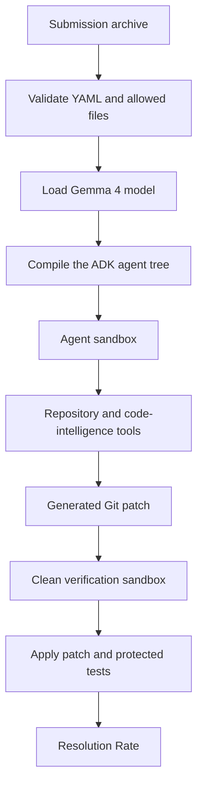
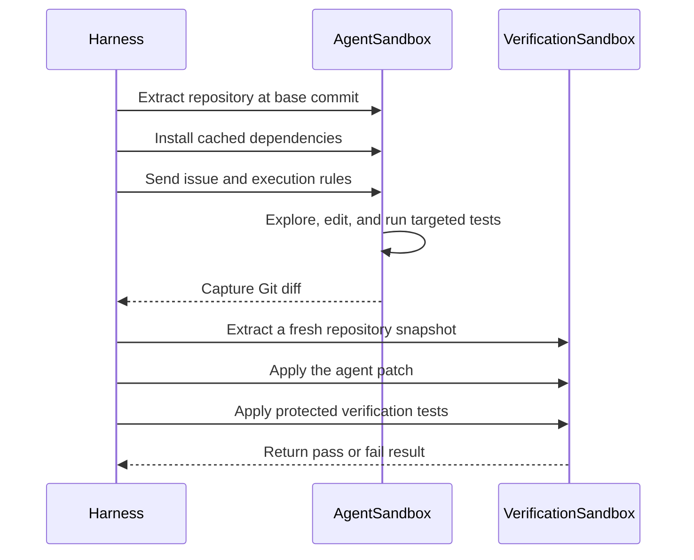
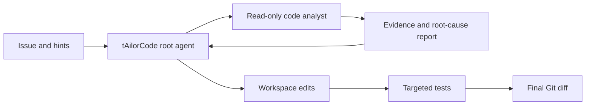

# tAilorCode Architecture

This document explains the project using the terminology of the competition harness.

## High-level flow

## Two sandbox stages

## Agent responsibilities

The root agent, `tAilorCode`, is responsible for the complete task. A read-only analyst can be delegated to locate relevant symbols and explain the likely root cause without modifying the repository.

## Design principles

1. Evidence before edits.
2. Minimal source changes.
3. Tests before submission.
4. No test or harness tampering.
5. Explicit final patch extraction.
6. Human review remains part of the workflow.

## Local evaluation note

The complete evaluation requires the competition harness, Gemma 4 model server, cached dependencies, and the sandbox environment. The public repository stores the agent configuration and explanations, while the downloaded competition data remains local and is excluded by `.gitignore`.

## Author

**Araceli Fradejas Munoz**
