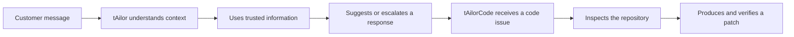

# tAilorCode: Project Story

## From customer support AI to autonomous code repair

I started with a practical question: what makes an AI assistant genuinely useful in a real workflow?

In my KelceTS projects, the assistant supported customer service teams. It had to understand a message, use trusted information, follow business rules, avoid inventing an answer, and escalate when the available evidence was not enough.

My autonomous-agent work added another layer: the system could use tools, follow a process, take actions, and record what happened.

The Gemma 4 Developer Agent Competition offered a natural next step. The user request is now a software issue, the knowledge base is a code repository, the action is a source-code change, and the final answer is a patch that must pass tests.

That is the idea behind tAilorCode.

## The project in one sentence

> tAilorCode is a grounded autonomous coding agent that turns a repository issue into a focused, test-verified patch.

## What makes it different from a simple chatbot?

A chatbot can produce a plausible explanation. tAilorCode must produce an actual change inside a repository and have that change survive verification in a clean environment.

The agent therefore has to:

- understand the issue before editing;
- gather evidence from source files and tests;
- use the available tools carefully;
- change the smallest relevant area;
- run targeted verification;
- return a reviewable Git diff.

## Authorship

This project is created, directed, and owned by **Araceli Fradejas Munoz**. It is being developed as my participation in the [Google - The Gemma 4 Developer Agent Competition](https://www.kaggle.com/competitions/gemma-4-developer-agent).
