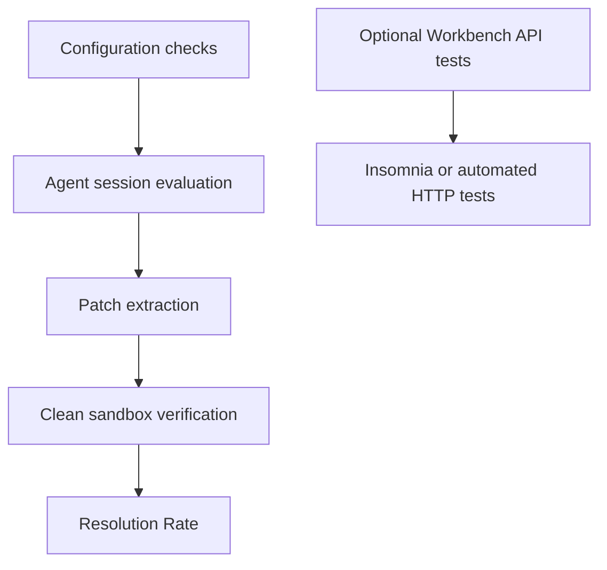
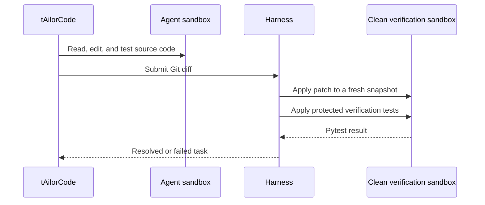

# tAilorCode Testing Strategy

## Short answer

Insomnia is not required for the competition submission. tAilorCode is not evaluated as an HTTP backend. The Kaggle harness sends a software issue to the agent, lets it inspect and modify a repository, captures the resulting Git diff, and verifies that patch in a clean sandbox with `pytest`.

Insomnia may become useful later if the optional `tAilorCode Workbench` exposes an HTTP API. That would test the demonstration layer, not the competition agent itself.

## Test layers



### 1. Configuration checks

These checks happen before an agent session starts:

- exactly one root YAML configuration exists;
- all `!include` paths stay inside the submission;
- the declared model is `gemma-4-31b-it-qat-w4a16-ct`;
- only permitted file types and structures are present;
- prompts and referenced sub-agents can be loaded;
- the unpacked submission remains below the size limit.

### 2. Agent behavior checks

During a task, tAilorCode must:

- understand the issue and acceptance criteria;
- inspect relevant source files and tests;
- avoid modifying tests or harness configuration;
- make a focused source-code change;
- run targeted tests or focused assertions;
- remove temporary files from the repository;
- call `submit_patch()` after verification.

### 3. Patch verification

The harness applies the generated patch to a fresh repository snapshot. It then restores protected test files, applies the hidden or published verification tests, and runs the required `pytest` targets.

A task is resolved only when the verification process reports a valid test run with no failures, errors, or relevant skips.



## Local validation plan

Until a compatible `swegemma` environment is available, we can still validate:

1. YAML and file structure.
2. Model declarations and includes.
3. Prompt clarity and tool ordering.
4. Mermaid diagrams and documentation links.
5. Dataset task selection and expected patch shape.

In Kaggle or a compatible evaluation environment, we will run:

```bash
swegemma eval \
  --tasks tasks.jsonl \
  --snapshots-dir snapshots \
  --submission-dir submission \
  --results-dir results/fastapi_14786 \
  --sandbox docker \
  --task-id fastapi_14786 \
  --max-tool-calls 50 \
  --max-time-minutes 30
```

## Optional Workbench testing

If the project later includes a `tAilorCode Workbench`, that layer can expose an HTTP endpoint for a developer interface. At that point we can test it with Insomnia or an automated client:

- submit a problem statement;
- receive the agent run identifier;
- inspect the generated plan and diff;
- retrieve test results;
- confirm error handling for invalid requests;
- verify that secrets and local paths are not exposed.

Those tests will be clearly separated from the Kaggle submission tests.

## Presentation notebook

The [companion notebook](../notebooks/tailorcode_introduction.ipynb) is public-facing documentation. It explains the project story, shows the Mermaid workflow, and provides a lightweight results table for future runs. It is deliberately separate from `submission.zip` and does not load the competition dataset by default.

## Author

**Araceli Fradejas Munoz**
